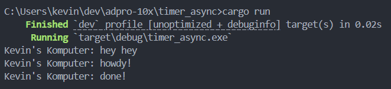
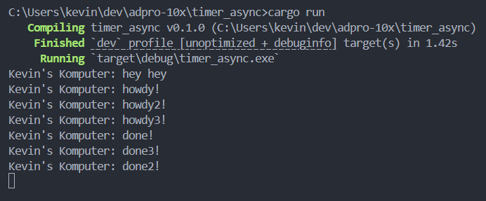
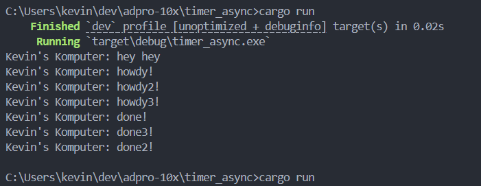
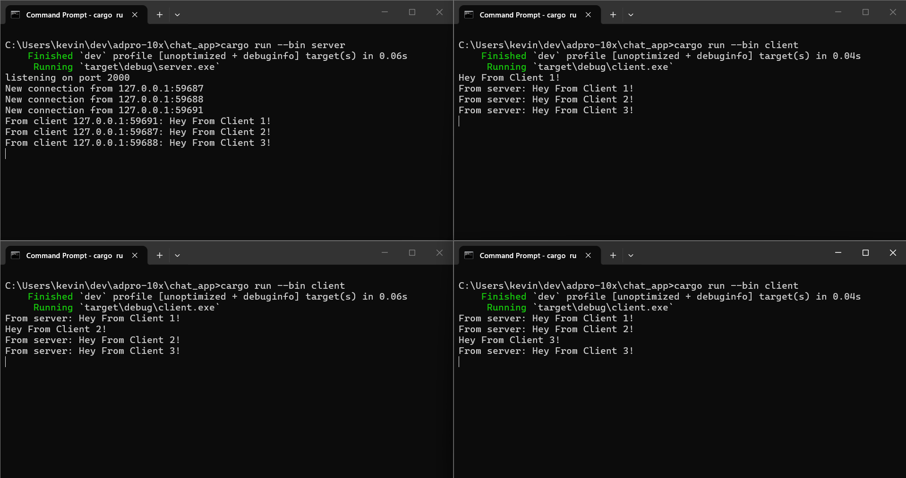

# Asynchronous Programming - Kevin Cornellius Widjaja (2406428781)

## Experiment 1.2: Understanding how it works

**Penjelasan:**
Saya menambahkan `println!("Kevin's Komputer: hey hey");` tepat setelah `spawner.spawn(...)` namun sebelum `drop(spawner);`. Ketika program dijalankan, output yang saya dapat adalah "Kevin's Komputer: hey hey" tercetak lebih dulu sebelum "howdy!" dan "done!".

Ini terjadi karena `spawner.spawn()` tidak langsung mengeksekusi future secara synchronous. Yang terjadi adalah future tersebut hanya dimasukan ke dalam sebuah task queue (antrian). Setelah itu, program utama (main thread) melanjutkan eksekusi ke baris kode berikutnya secara synchronous - yaitu perintah println "hey hey". Baru ketika `executor.run()` dipanggil di akhir, semua task yang ada di dalam queue akan diproses secara asynchronous oleh executor.

Intinya: spawn itu hanya untuk menyimpan task ke queue, sedangkan eksekusi yang sesungguhnya baru terjadi ketika executor menjalankan task tersebut.

## Experiment 1.3: Multiple Spawn and removing drop

**Penjelasan:**
Saya menduplikasi block `spawner.spawn()` tiga kali sehingga semua task berjalan secara concurrent. Terlihat bahwa semua pesan "howdy" muncul bersamaan, kemudian semua timer 2 detik berjalan bersamaan, dan semua pesan "done" muncul hampir di waktu yang sama.

**Mengapa program hang tanpa `drop(spawner)`?** Ketika `drop(spawner)` di-comment, sender pada channel tidak pernah ditutup. Executor yang memanggil `recv()` akan terus blocked menunggu task baru. Karena channel tidak pernah ditutup, `recv()` tidak pernah mengembalikan `Err`, sehingga loop `while let Ok(task)` tidak pernah berhenti dan program "hang" selamanya. Dengan `drop(spawner)`, channel ditutup dan executor bisa berhenti dengan graceful.

## Experiment 2.1: Original code, and how it run

**Cara menjalankan:**
1. Buka satu terminal dan jalankan `cargo run --bin server` untuk menyalakan WebSocket server di port 2000.
2. Buka tiga terminal lain dan jalankan `cargo run --bin client` untuk menghubungkan setiap client ke server.

**Apa yang terjadi saat mengetik teks di client:**
Ketika sebuah client mengetik teks dan mengirimkannya (tekan Enter), server menerima pesan (melalui koneksi websocket) tersebut lalu melakukan broadcast ke semua client lain yang sedang terhubung. Hasilnya, semua client menerima dan menampilkan pesan secara real-time. Fitur ini menunjukkan kemampuan Tokio dalam mengelola banyak koneksi websocket secara concurrent tanpa blocking.

## Experiment 2.2: Modifying port

**Penjelasan:**
Saya mengubah port websocket dari 2000 ke 8080. Perubahan dilakukan di dua file:

1. **`src/bin/server.rs`**: Mengubah `TcpListener::bind("127.0.0.1:2000")` menjadi `TcpListener::bind("127.0.0.1:8080")` agar server mendengarkan koneksi pada port 8080.

2. **`src/bin/client.rs`**: Mengubah URI dari `ws://127.0.0.1:2000` menjadi `ws://127.0.0.1:8080` agar client terhubung ke port yang benar.

Kedua belah pihak (server dan client) harus menggunakan port yang sama agar websocket handshake dan komunikasi TCP bisa terjalin. Protokol websocket menggunakan `ws://` sebagai scheme-nya.
