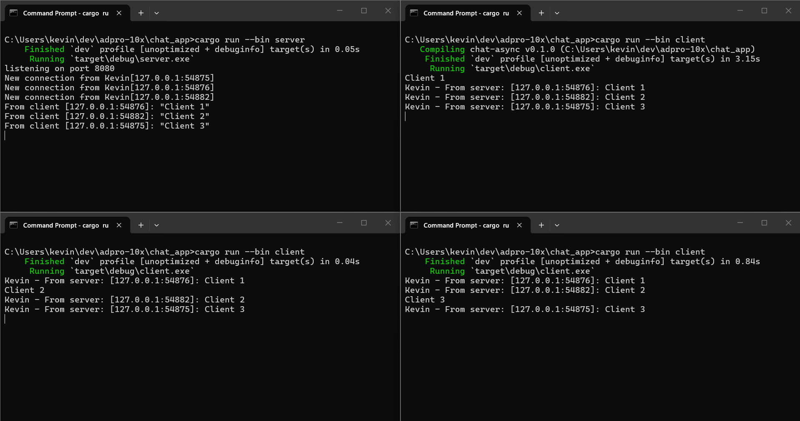
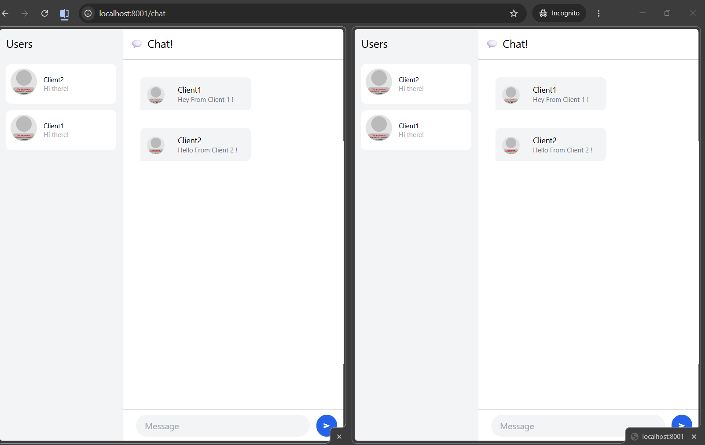
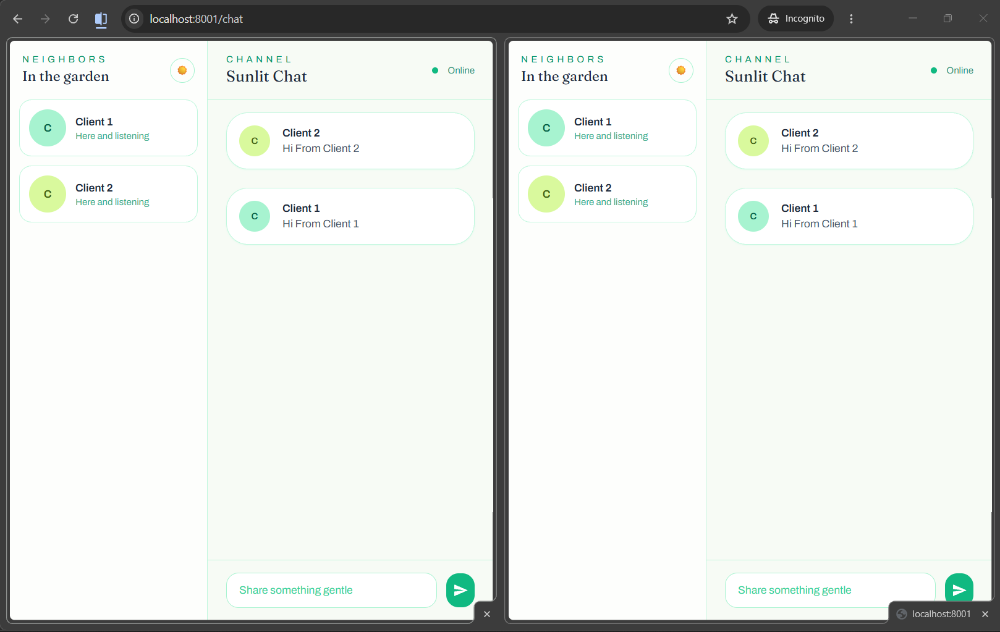
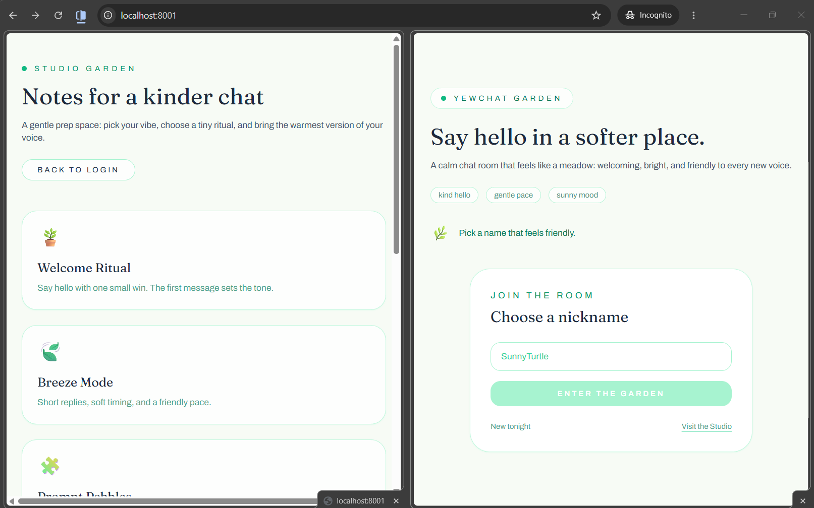
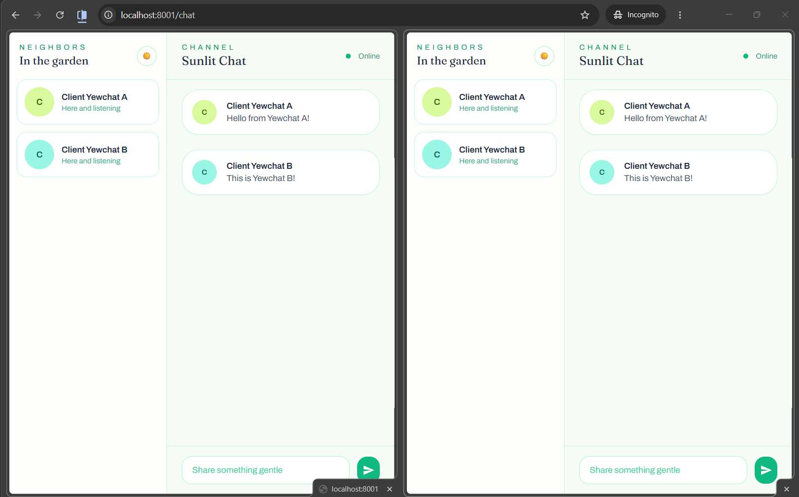
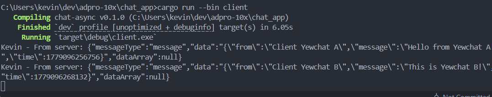
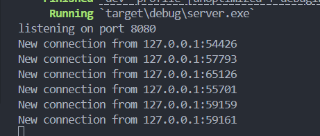

# Asynchronous Programming - Kevin Cornellius Widjaja (2406428781)

## Experiment 1.2: Understanding how it works

**Penjelasan:**
Saya menambahkan `println!("Kevin's Komputer: hey hey");` tepat setelah `spawner.spawn(...)` namun sebelum `drop(spawner);`. Ketika program dijalankan, output yang saya dapat adalah "Kevin's Komputer: hey hey" tercetak lebih dulu sebelum "howdy!" dan "done!".

Ini terjadi karena `spawner.spawn()` tidak langsung mengeksekusi future secara synchronous. Yang terjadi adalah future tersebut hanya dimasukan ke dalam sebuah task queue (antrian). Setelah itu, program utama (main thread) melanjutkan eksekusi ke baris kode berikutnya secara synchronous - yaitu perintah println "hey hey". Baru ketika `executor.run()` dipanggil di akhir, semua task yang ada di dalam queue akan diproses secara asynchronous oleh executor.

Intinya: spawn itu hanya untuk menyimpan task ke queue, sedangkan eksekusi yang sesungguhnya baru terjadi ketika executor menjalankan task tersebut.

## Experiment 1.3: Multiple Spawn and removing drop

**Penjelasan:**
Saya menduplikasi block `spawner.spawn()` tiga kali sehingga semua task berjalan secara concurrent. Terlihat bahwa semua pesan "howdy" muncul bersamaan, kemudian semua timer 2 detik berjalan bersamaan, dan semua pesan "done" muncul hampir di waktu yang sama.

**Mengapa program hang tanpa `drop(spawner)`?** Ketika `drop(spawner)` di-comment, sender pada channel tidak pernah ditutup. Executor yang memanggil `recv()` akan terus blocked menunggu task baru. Karena channel tidak pernah ditutup, `recv()` tidak pernah mengembalikan `Err`, sehingga loop `while let Ok(task)` tidak pernah berhenti dan program "hang" selamanya. Dengan `drop(spawner)`, channel ditutup dan executor bisa berhenti dengan graceful.

## Experiment 2.1: Original code, and how it run

**Cara menjalankan:**
1. Buka satu terminal dan jalankan `cargo run --bin server` untuk menyalakan WebSocket server di port 2000.
2. Buka tiga terminal lain dan jalankan `cargo run --bin client` untuk menghubungkan setiap client ke server.

**Apa yang terjadi saat mengetik teks di client:**
Ketika sebuah client mengetik teks dan mengirimkannya (tekan Enter), server menerima pesan (melalui koneksi websocket) tersebut lalu melakukan broadcast ke semua client lain yang sedang terhubung. Hasilnya, semua client menerima dan menampilkan pesan secara real-time. Fitur ini menunjukkan kemampuan Tokio dalam mengelola banyak koneksi websocket secara concurrent tanpa blocking.

## Experiment 2.2: Modifying port

**Penjelasan:**
Saya mengubah port websocket dari 2000 ke 8080. Perubahan dilakukan di dua file:

1. **`src/bin/server.rs`**: Mengubah `TcpListener::bind("127.0.0.1:2000")` menjadi `TcpListener::bind("127.0.0.1:8080")` agar server mendengarkan koneksi pada port 8080.

2. **`src/bin/client.rs`**: Mengubah URI dari `ws://127.0.0.1:2000` menjadi `ws://127.0.0.1:8080` agar client terhubung ke port yang benar.

Kedua belah pihak (server dan client) harus menggunakan port yang sama agar websocket handshake dan komunikasi TCP bisa terjalin. Protokol websocket menggunakan `ws://` sebagai scheme-nya.

## Experiment 2.3: Small changes, add IP and Port

**Penjelasan Modifikasi:**
Saya memodifikasi server agar menampilkan IP dan Port pengirim pada setiap pesan broadcast. Perubahan dilakukan di `handle_connection` dalam `server.rs` - setiap kali server menerima pesan dari client, ia mengekstrak `addr.ip()` dan `addr.port()` dari variabel `addr` (bertipe `SocketAddr`) kemudian memformat ulang pesan menjadi `[IP:Port]: message`. Pesan yang sudah diformat inilah yang kemudian di-broadcast ke semua client.

Output yang terlihat:
- **Server console:** `New connection from Kevin[127.0.0.1:54875]` dan `From client [127.0.0.1:54875]: "hi"`
- **Client console:** `Kevin - From server: [127.0.0.1:54875]: Client 3`

## Experiment 3.1: Original code

**Penjelasan:**
Saya mensetup proyek YewChat yang terdiri dari dua bagian:
1. **Yew Frontend (Rust + WebAssembly):** Aplikasi webchat berbasis Yew framework yang di-compile ke WebAssembly. Frontend berkomunikasi dengan server melalui websocket.
2. **SimpleWebsocketServer (Node.js):** Server websocket berbasis JavaScript/TypeScript yang menjalankan `npm start` pada port 8080.

Untuk menjalankan:
1. Jalankan server: `cd SimpleWebsocketServer && npm start`
2. Build dan jalankan frontend dengan wasm-pack (`cd YewChat && npm install && npm run wasm && npm run start`)
3. Buka browser dan akses aplikasi webchat

Ketika user mengetik pesan, pesan tersebut dikirim ke server websocket lalu di-broadcast ke semua client yang terhubung secara real-time.

## Experiment 3.2: UI Revamp YewChat

**Penjelasan:**
Saya melakukan perubahan tampilan YewChat agar lebih sederhana dan tenang. Detail perubahan:
- **Warna:** Mengganti latar ke warna solid hijau lembut (#f7fbf5), kartu putih bersih, dan aksen hijau (emerald/lime/teal) supaya tampilan terasa rapi dan ringan.
- **Layout:** Login disusun dua kolom (teks di kiri, form di kanan) dengan card yang lebih kompak. Halaman chat dipisah jelas antara sidebar user dan area chat utama, dengan header tipis dan input di bawah yang clean.
- **Page tambahan:** Menambahkan halaman "Studio" sebagai landing singkat sebelum chat, berisi tips ringan dan mood/ritual untuk memulai percakapan.
- **Ikon & avatar:** Menghapus avatar gambar dan menggantinya dengan badge inisial berbentuk lingkaran dengan warna solid berbeda-beda agar konsisten dan ringan.
- **Tipografi & komponen:** Menggunakan font display untuk judul, rounded corners di card/input/button, dan teks yang lebih friendly.

## Bonus: Rust WebSocket Server untuk YewChat

**Penjelasan perubahan:**
Saya memodifikasi server Rust di Tutorial 2 supaya kompatibel dengan format pesan YewChat (Tutorial 3). Perubahan utama:
- **Format pesan:** Server sekarang menerima JSON dengan field `messageType`, `data`, dan `dataArray`. Pesan tetap dikirim sebagai text frame, hanya kontennya berupa JSON string (serialize/deserialize).
- **Register & users list:** Saat client mengirim `messageType: register`, server menyimpan username berdasarkan socket address lalu membroadcast daftar user dengan `messageType: users`.
- **Message broadcast:** Saat `messageType: message`, server mencari nama pengirim, membungkus payload `{ from, message, time }`, lalu membroadcast JSON `messageType: message` ke semua client.
- **Disconnect cleanup:** Ketika client disconnect, server menghapus user dari map lalu mengirim ulang daftar user.

**Mengapa ini berhasil:**
- YewChat sudah mengirim data sebagai text frame JSON, jadi server Rust hanya perlu membaca string lalu `serde_json::from_str`.
- Response dari server mengikuti skema yang sama seperti SimpleWebsocketServer, sehingga komponen YewChat (`WebSocketMessage`) bisa mem-parse tanpa perubahan.
- Port server tetap `8080`, cocok dengan URL websocket YewChat (`ws://127.0.0.1:8080`).

**Preferensi saya:**
Saya lebih prefer **Rust server** karena type safety, lebih mudah menjaga kontrak JSON, dan performa/concurrency-nya kuat untuk banyak koneksi. Namun versi **JavaScript** lebih cepat untuk prototyping karena setup lebih sederhana. Untuk produksi atau skala besar, saya pilih Rust.